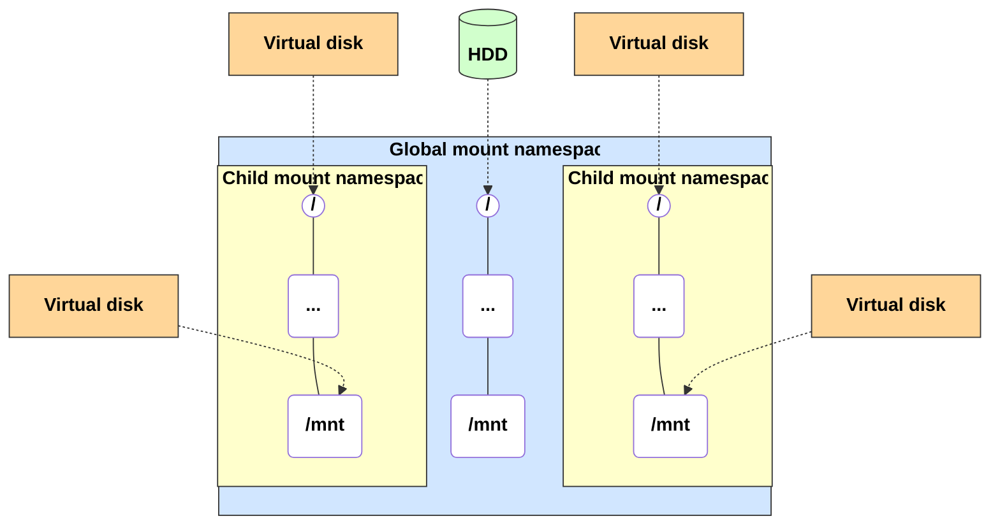
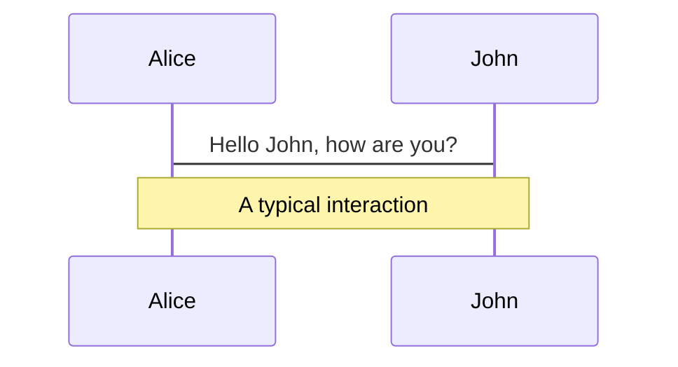
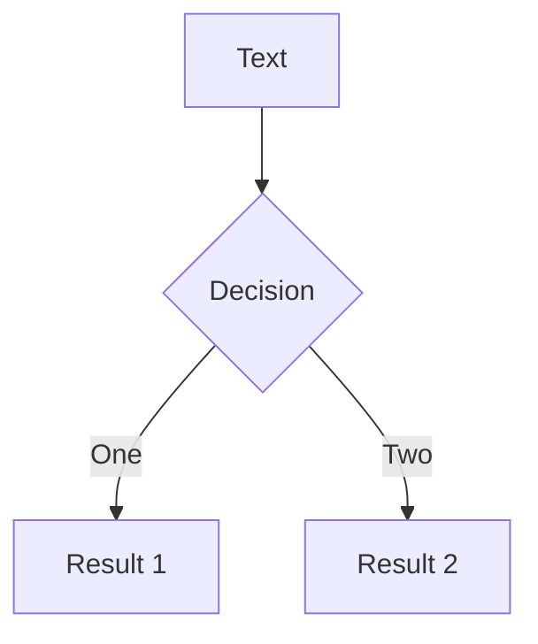
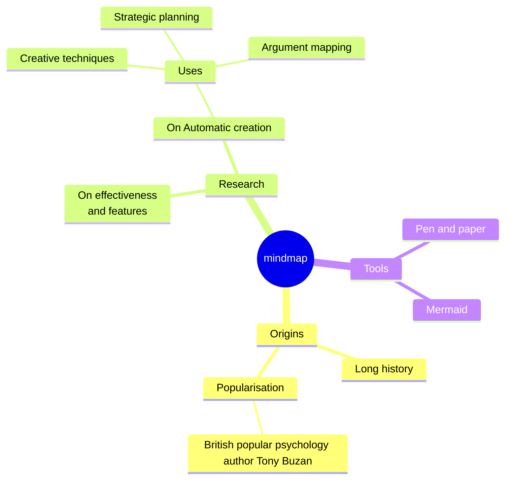
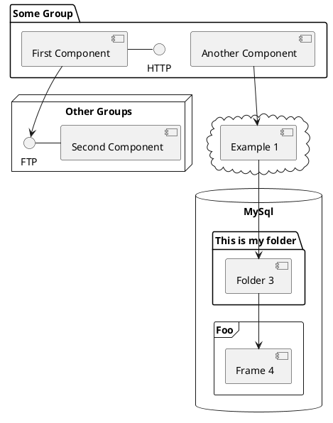

```mermaid
flowchart LR
    subgraph Hardware["Hardware Físico"]
        direction TB
        CPU["CPU Física"] --- RAM["RAM Física"] --- Storage["Almacenamiento"] --- Network["Red"]
    end
    
    subgraph Host["SO Host + Kernel Linux"]
        direction TB
        HostOS["SO Host Linux"] --- Kernel["Kernel Linux Compartido"]
        Kernel --- Features["Namespaces | Cgroups | UnionFS | SELinux"]
    end
    
    subgraph Runtime["Container Runtime"]
        direction TB
        Docker["Docker/Podman"] --- LibC["libcontainer/runc"]
    end
    
    subgraph Containers["Contenedores"]
        direction TB
        subgraph C1["Contenedor n"]
            Bins1["Binarios/Libs"] --- App1["App 1"]
        end
    end
    
    Hardware --> Host --> Runtime --> Containers
    
    %% Estilos
    classDef hardware fill:#8C6E4E,color:white,stroke:#5D4A33,stroke-width:2px
    classDef host fill:#4E6E8C,color:white,stroke:#3B536B,stroke-width:2px
    classDef runtime fill:#6E4E8C,color:white,stroke:#523B6B,stroke-width:2px
    classDef container fill:#4E8C6E,color:white,stroke:#3B6B53,stroke-width:2px
    classDef component fill:#FFFFFF,stroke:#333333,stroke-width:1px
    
    class Hardware hardware
    class Host host
    class Runtime runtime
    class Containers,C1,C2,C3 container
    class CPU,RAM,Storage,Network,HostOS,Kernel,Features,Docker,LibC,Bins1,Bins2,Bins3,App1,App2,App3 component
```

---
fonts:
  mono: 'Fira Code'
  sans: 'Fira Sans'
author: Francisco Sanabria @ Datasite
# You can also start simply with 'default'
theme: default
# random image from a curated Unsplash collection by Anthony
# like them? see https://unsplash.com/collections/94734566/slidev
# background: https://cover.sli.dev
# some information about your slides (markdown enabled)
title: Linux para contenerización y Kubernetes
info: |
  Linux para contenerización y Kubernetes
# apply unocss classes to the current slide
class: text-center
# https://sli.dev/features/drawing
drawings:
  persist: false
# slide transition: https://sli.dev/guide/animations.html#slide-transitions
transition: fade-out
# enable MDC Syntax: https://sli.dev/features/mdc
mdc: true
# open graph
# seoMeta:
#  ogImage: https://cover.sli.dev
---
# Linux para contenerización

Nivel Intermedio - Avanzado 

Pre-taller para Kubernetes

<div class="abs-br m-6 text-xl">
  <button @click="$slidev.nav.openInEditor()" title="Open in Editor" class="slidev-icon-btn">
    <carbon:edit />
  </button>
  <a href="https://github.com/fcosanabria" target="_blank" class="slidev-icon-btn">
    <carbon:logo-github />
  </a>
</div>

<div class="absolute left-30px bottom-30px">
  Datasite
</div>

<!--
The last comment block of each slide will be treated as slide notes. It will be visible and editable in Presenter Mode along with the slide. [Read more in the docs](https://sli.dev/guide/syntax.html#notes)
-->

---
layout: image-right
image: https://dropsharebluewhale.blob.core.windows.net/dropshare/2025-04-18-12.22.52.png
---

# Francisco Sanabria

Site Reliability Engineer @ Datasite

- <div v-click>Professional Nerd | Homelab | Visual Artist</div>

- <div v-click>Certified Kubernetes Administrator</div>

- <div v-click>10 years of experience in IT</div>

<!--
You can have `style` tag in markdown to override the style for the current page.
Learn more: https://sli.dev/features/slide-scope-style
-->

<style>
h1 {
  background-color: #2B90B6;
  background-image: linear-gradient(45deg,rgb(148, 82, 142) 10%, #146b8c 50%);
  background-size: 100%;
  -webkit-background-clip: text;
  -moz-background-clip: text;
  -webkit-text-fill-color: transparent;
  -moz-text-fill-color: transparent;
}
</style>

<!--
Here is another comment.
-->
---
layout: two-cols
layoutClass: gap-16
---

# Agenda

Esta será la agenda para el día de hoy: 

::right::

<Toc text-sm minDepth="1" maxDepth="2" />

---

# Herrramientas

- Fira Sans
- Fira Code
- Sli.dev
  - Markdown based slides

---

# 쯃inux?
  ---

<div v-click>

쮺ontenerización?

쯂ubernetes?

</div>

<!-- 
El motivo de dar toda esta instruducción es por que lo que vamos a ver en el próximo taller no es magia, y tiene su razón de ser, con implementaciones de Linux como sistema operativo. 
 -->

<div v-click>¡No es magia!</div>

---

# Linux Namespaces
Espacios de nombre en Linux

<!-- 
Los namespaces son una característica fundamental del kernel de Linux que permite crear abstracciones de recursos del sistema operativo, haciendo que un proceso o grupo de procesos vean su propia instancia aislada de un recurso global. 
 -->

- Permite crear abstracciones de recursos en el SO.
- Los procesos ven su propia instanacia de una forma *aislada* a un todo. 
- Es una manera lógica de separación de recursos.

<!-- Esta tecnología es la piedra angular que hace posible la contenerización. -->

- Existen muchos tipos de namespaces o *espacios de nombre*.

<div v-click>

**Veamos algunos ejemplos**

</div>

---

# Tipos de Linux Namespaces
Espacios de nombre en Linux

<!-- Basicamente lo que hace es envolver un recurso global del sistema en una abstracción, haciendo parecer a los procesos dentro de ese espacio sean ajenos al recurso global.

Por lo que no afectan al sistema
 -->

| Espacio de nombres | Aislados |
|:---|:---|
| <span v-mark.circle.red="2">Mount</span> | <span v-mark.underline.orange="2">Puntos de Montaje</span> |
| <span v-mark.circle.red="2">Network</span> | <span v-mark.underline.orange="2">Dispositivos de red, stacks, puertos, etc.</span>  |
| User | Identificación de usuarios y grupos |
| Control Groups | Directorio raíz del grupo de control |
| PID| Identificadores de procesos |


<!-- Estos podriamos decir que son los más importantes, puesto que son los que se pueden interacturar de manera más frequente; cuando hablamos de administración de sistemas y servidores.
 -->

<div v-click="1">

Hay varios más

</div>

<!-- Con los usuarios y grupos, ahora esto normalmente se encuentra automatizado por terceros al momento de ofrecer el servicio en la nube. -->

---

## Ejemplo: Mount: puntos de montaje


<!-- 
Este diagrama representa el funcionamiento de los namespaces de montaje (Mount Namespaces) en Linux, que son una de las características fundamentales que hacen posible la tecnología de contenedores.

Lo que estamos viendo aquí es una representación visual de cómo Linux puede crear múltiples vistas del sistema de archivos dentro del mismo sistema operativo:

Veamos la Estructura del diagrama:

El rectángulo azul exterior representa el 'Namespace Global de Montaje', que es la vista del sistema de archivos que tendría el sistema. Contiene la estructura básica con el directorio, que conocemos como root (/), directorios varios (...) y puntos especificos de montaje como /mnt.

Los rectángulos amarillos son 'Namespaces Hijos, basicamente, del Montaje', que representan vistas distintas o aisladas del sistema de archivos, del filesystem. Ahora, cada uno tiene su propia jerarquía de directorios que puede ser completamente diferente de la del host.

Las líneas punteadas muestran cómo diferentes dispositivos de almacenamiento se montan en distintos puntos:

El disco físico (HDD, en verde) está montado en la raíz del sistema host
Los discos virtuales (en naranja) están montados en diferentes puntos dentro de los namespaces hijo -->

---

## HandsOn 1.1
Ejercicios Prácticos

PID Namespace

> *Objectivo*: Muestra cómo el proceso `/bin/bash` tiene PID 1 dentro del namespace, pero un PID diferente en el host.
```bash
sudo unshare --pid --fork --mount-proc /bin/bash
ps aux  # Mostrará una lista de procesos muy reducida con PID 1
```
---

## HandsOn 1.2
Ejercicios Prácticos

Network Namespace
> Objetivo: Crear un par Virtual Ethernet (veth) para conectar un namespace de red con el host
```bash
# Crear un par de interfaces virtuales
sudo ip link add veth0 type veth peer name veth1
# Mover veth1 al namespace
sudo ip link set veth1 netns demo_ns
# Configurar IPs
sudo ip addr add 192.168.100.1/24 dev veth0
sudo ip netns exec demo_ns ip addr add 192.168.100.2/24 dev veth1
# Activar interfaces
sudo ip link set veth0 up
sudo ip netns exec demo_ns ip link set veth1 up
sudo ip netns exec demo_ns ip link set lo up
# Probar conectividad
sudo ip netns exec demo_ns ping 192.168.100.1
```

---

## HandsOn 1.3
Ejercicios Prácticos

Mount Namespace

<!-- Recordemos: Aísla puntos de montaje del sistema de archivos, permitiendo que diferentes procesos vean diferentes jerarquías de sistemas de archivos. -->

> Objetivo: Permite que cada contenedor tenga su propio sistema de archivos root y puntos de montaje.

```bash
mkdir /tmp/mount-demo
sudo unshare --mount /bin/bash
mount -t tmpfs none /tmp/mount-demo
# Este montaje solo será visible en este namespace
```

<!-- 

Intentar lo siguiente:

# Crear un directorio para un "mini contenedor"
mkdir -p /tmp/container-root
# Crear un archivo en el host
echo "Esto es el host" > /tmp/host-file.txt

# Crear un nuevo namespace de montaje
sudo unshare --mount --uts --pid --fork --mount-proc=/proc /bin/bash

# Dentro del nuevo namespace, montar un nuevo root
mount --bind /tmp/container-root /tmp/container-root
cd /tmp/container-root
mkdir -p bin etc dev proc
# Montar proc en el nuevo namespace
mount -t proc none proc/
# Crear un archivo dentro del contenedor
echo "Estoy dentro del contenedor" > container-file.txt

# Mostrar que ambos sistemas de archivos son diferentes
# pero comparten el mismo kernel
cat /proc/version
ls -la /
# No podemos ver /tmp/host-file.txt desde aquí

 -->

---

# Networking para entornos containerizados
Redes 🤝🏻 Contenedores

Los network namespaces son la base del aislamiento de red en contenedores. Cada namespace proporciona una pila (stack) de red completamente independiente con sus propias:

- Network interfaces
- Routing tables
- Firewall rules
- Sockets

<!-- 
Interfaces de red
Tablas de enrutamiento
Reglas de firewall
Sockets 

Explicación: los namespaces son como "burbujas" de red aisladas.

A este punto no hemos visto que es un contenedor, y probablemente ya lo sepan o no, pero por el momento, quedemonos con la idea de que un contenedor es una manera de embolver una applicación o un servicio del sistema.

Ojo que no estamos hablando de ningun Container Engine, como lo es Docker, o Podman o Linux Containers. Recordemos que por el momento solo estamos hablando de Namespaces como contenedores del sistema. 

Pronto vamos a ver a Container Engines. Pero despues. 

-->


---
highlighter: shiki
lineNumbers: true
---

# Creación y Examinación de Namespaces

````md magic-move {lines: true}
```bash
# Crear dos namespaces
sudo ip netns add ns1
sudo ip netns add ns2
```

```bash
# Crear dos namespaces
sudo ip netns add ns1
sudo ip netns add ns2

# Examinando namespaces
sudo ip netns exec ns1 ip link show
sudo ip netns exec ns2 ip link show
```

```bash
# Examinando namespaces
sudo ip netns exec ns1 ip link show
1: lo: <LOOPBACK> mtu 65536 qdisc noop state DOWN mode DEFAULT group default qlen 1000
    link/loopback 00:00:00:00:00:00 brd 00:00:00:00:00:00
2: tunl0@NONE: <NOARP> mtu 1480 qdisc noop state DOWN mode DEFAULT group default qlen 1000
    link/ipip 0.0.0.0 brd 0.0.0.0
3: sit0@NONE: <NOARP> mtu 1480 qdisc noop state DOWN mode DEFAULT group default qlen 1000
    link/sit 0.0.0.0 brd 0.0.0.0
4: ip6tnl0@NONE: <NOARP> mtu 1452 qdisc noop state DOWN mode DEFAULT group default qlen 1000
    link/tunnel6 :: brd :: permaddr 86c3:80e5:c593::
```

```bash
# Examinando namespaces
sudo ip netns exec ns1 ip link show
1: lo: <LOOPBACK> mtu 65536 qdisc noop state DOWN mode DEFAULT group default qlen 1000
    link/loopback 00:00:00:00:00:00 brd 00:00:00:00:00:00
2: tunl0@NONE: <NOARP> mtu 1480 qdisc noop state DOWN mode DEFAULT group default qlen 1000
    link/ipip 0.0.0.0 brd 0.0.0.0
3: sit0@NONE: <NOARP> mtu 1480 qdisc noop state DOWN mode DEFAULT group default qlen 1000
    link/sit 0.0.0.0 brd 0.0.0.0
4: ip6tnl0@NONE: <NOARP> mtu 1452 qdisc noop state DOWN mode DEFAULT group default qlen 1000
    link/tunnel6 :: brd :: permaddr 86c3:80e5:c593::

sudo ip netns exec ns2 ip link show
```

```bash
# Examinando namespaces
sudo ip netns exec ns1 ip link show
1: lo: <LOOPBACK> mtu 65536 qdisc noop state DOWN mode DEFAULT group default qlen 1000
    link/loopback 00:00:00:00:00:00 brd 00:00:00:00:00:00
2: tunl0@NONE: <NOARP> mtu 1480 qdisc noop state DOWN mode DEFAULT group default qlen 1000
    link/ipip 0.0.0.0 brd 0.0.0.0
3: sit0@NONE: <NOARP> mtu 1480 qdisc noop state DOWN mode DEFAULT group default qlen 1000
    link/sit 0.0.0.0 brd 0.0.0.0
4: ip6tnl0@NONE: <NOARP> mtu 1452 qdisc noop state DOWN mode DEFAULT group default qlen 1000
    link/tunnel6 :: brd :: permaddr 86c3:80e5:c593::

sudo ip netns exec ns2 ip link show
1: lo: <LOOPBACK> mtu 65536 qdisc noop state DOWN mode DEFAULT group default qlen 1000
    link/loopback 00:00:00:00:00:00 brd 00:00:00:00:00:00
2: tunl0@NONE: <NOARP> mtu 1480 qdisc noop state DOWN mode DEFAULT group default qlen 1000
    link/ipip 0.0.0.0 brd 0.0.0.0
3: sit0@NONE: <NOARP> mtu 1480 qdisc noop state DOWN mode DEFAULT group default qlen 1000
    link/sit 0.0.0.0 brd 0.0.0.0
4: ip6tnl0@NONE: <NOARP> mtu 1452 qdisc noop state DOWN mode DEFAULT group default qlen 1000
    link/tunnel6 :: brd :: permaddr 9aaf:2eb4:1e3e::
```
````

---

# Comparando Network Namespaces

<div v-click>
<h3>Diferencias Entre Namespaces</h3>

Estos namespaces son idénticos excepto por una diferencia clave:

<div class="grid grid-cols-2 gap-4">
<div>
<h4>NS1</h4>

```bash
link/tunnel6 :: brd :: permaddr 86c3:80e5:c593::
```
</div>
<div>
<h4>NS2</h4>

```bash
link/tunnel6 :: brd :: permaddr 9aaf:2eb4:1e3e::
```
</div>
</div>
</div>

<div v-click>
<h3>쯈ué significa esto?</h3>

Cada namespace tiene un identificador único para su interfaz de túnel IPv6
</div>

---

# Explicación Detallada

<div v-click>
<h3>쯇or qué son diferentes?</h3>

Cada namespace es un entorno de red aislado con:

- Sus propias interfaces de red
- Sus propias tablas de enrutamiento
- Sus propias reglas de firewall
</div>

<div v-click>

El identificador único (<span v-mark.circle.red>permaddr</span>) asegura que cada namespace pueda ser identificado de manera única en la red, incluso cuando usan interfaces virtuales con la misma configuración.

</div>

<div v-click>

- Los namespaces de red permiten aislar entornos de red completos

- Cada namespace tiene sus propios dispositivos de red independientes

- Son la base de tecnologías como contenedores y virtualización ligera

</div>

---

## Casos de uso comunes

<div v-click>

- Contenedores (Docker, LXC)
- Virtualización de redes (NFV)
- Aislamiento de servicios
- Entornos multi-tenant

Eventualmente veremos los modelos de redes para los contenedores. 

</div>

<!-- PEROOOOOOOO -->

<div v-click>
🚨 Spoiler alert 🚨 es un puente; bridge networking model
</div>

<!-- 
... Que es por defecto.

Aunque sí, hay otras como Host, y Overlay, donde el contenedor comparte el ns de red del host y donde se permite la comunicacion entre contenededore en diferentes hosts.-->


---

# DNS y Service Discovery
Resolución de nombres en entornos containerizados

La resolución de nombres es <span v-mark.underline.orange>crucial</span> para la comunicación entre servicios en entornos de contenedores.

<!-- Existen varios mecanismos para resolucion de nombres en entornos de contenedores. -->
<div v-click>
Sistemas DNS en entornos de contenedores
  <div class="grid grid-cols-3 gap-4">
    <div class="p-4 border rounded">
      <h4>DNS interno en Docker</h4>
      <!-- <p>Sistema incorporado que permite resolución por nombre de contenedor en la misma red</p> -->
    </div>
    <div class="p-4 border rounded">
      <h4>CoreDNS en Kubernetes</h4>
      <!-- <p>Solución flexible y extensible para clústers de Kubernetes</p> -->
    </div>
    <div class="p-4 border rounded">
      <h4>Resolución basada en archivos hosts</h4>
      <!-- <p>Método tradicional que aún se utiliza como respaldo</p> -->
    </div>
  </div>
</div>

---

# Funcionamiento Interno de DNS en Contenedores

<!-- Un orquestador es un sistema para poder controlar de manera eficaz y masiva contenedores -->

Proceso general de resolución DNS en contenedores

````md magic-move {lines: true}
```
1. Registro de contenedor en DNS
2. Configuración de resolución en el contenedor
3. Búsqueda recursiva (si es necesario)
```

```
1. Registro de contenedor en DNS
   - Al iniciar, el orquestador registra el contenedor con su nombre
   - Se asocia la IP interna con el nombre del contenedor

2. Configuración de resolución en el contenedor
3. Búsqueda recursiva (si es necesario)
```

```
1. Registro de contenedor en DNS
   - Al iniciar, el orquestador registra el contenedor con su nombre
   - Se asocia la IP interna con el nombre del contenedor

2. Configuración de resolución en el contenedor
   - Se configura /etc/resolv.conf internamente
   - El DNS del orquestador se configura como nameserver principal

3. Búsqueda recursiva (si es necesario)
```

```
1. Registro de contenedor en DNS
   - Al iniciar, el orquestador registra el contenedor con su nombre
   - Se asocia la IP interna con el nombre del contenedor

2. Configuración de resolución en el contenedor
   - Se configura /etc/resolv.conf internamente
   - El DNS del orquestador se configura como nameserver principal

3. Búsqueda recursiva (si es necesario)
   - Si no se encuentra en el DNS local, consulta DNS externos
   - Sigue la cadena de resolución configurada
```
````

> Más adelante veremos esto, con ejemplos reales. Referirme a: # DESPUES: Demostración de resolución DNS en Docker

<!-- Y sí, sé que nos faltaron ver seguridad, y almacenamiento, pero si lo vemos, nunca terminariamos. -->

---

# Fundamentos de los Contenedores Linux

  - <span v-mark.underline.orange>Historia y evolución</span>: de chroot a contenedores modernos
  <!-- chroot (1979) fue el inicio, aislando el root filesystem. Que de hecho, este comando nos facilita un montón el cambio de la contraseña de root en un servidor, ya que este despues de aislar y re-indexar la metadata del sistema, el sistema vuelve a la normalidad.  
  
  Luego vinieron Jails (FreeBSD, 2000), Solaris Zones (2004), OpenVZ (2005), LXC (2008) y finalmente Docker (2013) popularizó el concepto. -->
  
  - <span v-mark.underline.orange>Arquitectura fundamental</span>: Namespaces y Cgroups
  <!-- Los Namespaces (PID, NET, MNT, etc.) aíslan la vista de los recursos. Los Cgroups (Control Groups) limitan y monitorizan el uso de recursos (CPU, memoria, I/O). -->
  
  - <span v-mark.underline.orange>Diferencias</span> entre contenedores y máquinas virtuales (VMs)
  <!-- Contenedores comparten el kernel del host, son más ligeros y rápidos. VMs virtualizan hardware y ejecutan un SO completo, vamos a ver... esto proporciona un mayor aislamiento pero genera más sobrecarga en el poder computación. -->
  
  - <span v-mark.underline.orange>Casos de uso</span> y limitaciones
  <!-- Ideales para microservicios, Continous Integration and Continous Delivery CI/CD, desarrollo y demás. 
  
  Limitaciones es que no podemos ejecutar SOs diferentos al host. Y lo mismo aplica para las arquitecturas. No se virtualizar. Se pueden emular, sí, pero es distinto a la virtualización. 
  
  Y por que no se puede? recordemos que el kernel es compartido. En aislamiento de seguridad (kernel compartido)-->


---

<!-- hablemos sobre los namespaces

No mentira, ya lo vimos. Estoy molestando, no lo vamos a ver otra vez.
 -->

# Arquitectura fundamental
Namespaces

<div v-click>


</div>

---

# Diferencias entre contenedores y máquinas virtuales
Máquinas Virtuales

<!-- En el primer diagrama podemos observar la estructura en capas de las máquinas virtuales:

- Base física: El hardware subyacente que proporciona los recursos físicos (CPU, RAM, almacenamiento y red).
- Sistema operativo host: La capa que gestiona el acceso al hardware físico.
- Hipervisor: La tecnología de virtualización que crea y gestiona las máquinas virtuales. El hipervisor emula hardware virtual para cada VM.
Máquinas virtuales independientes: Cada una con:

- Un sistema operativo completo (con su propio kernel)
- Sus propias bibliotecas y binarios
- Las aplicaciones que se ejecutan en su interior -->

La característica más destacable es que cada máquina virtual funciona como un SO e independiente, con su propio sistema operativo. Implica mayor sobrecarga pero también un mayor aislamiento.

```mermaid

flowchart LR
    subgraph Hardware["Hardware Físico"]
        direction TB
        CPU["CPU Física"] --- RAM["RAM Física"] --- Storage["Almacenamiento"] --- Network["Red"]
    end
    
    subgraph Host["SO Host"]
        direction TB
        HostOS["Sistema Operativo Host"]
    end
    
    subgraph Hypervisor["Hipervisor"]
        direction TB
        VMM["Virtual Machine Monitor"]
    end
    
    subgraph VMs["Máquinas Virtuales"]
        direction TB
        subgraph VM1["VM 1"]
            GuestOS1["SO Completo"] --- Bins1["Bins/Libs"] --- App1["App 1"]
        end
    end
    
    Hardware --> Host --> Hypervisor --> VMs
    
    %% Estilos
    classDef hardware fill:#8C6E4E,color:white,stroke:#5D4A33,stroke-width:2px
    classDef host fill:#4E6E8C,color:white,stroke:#3B536B,stroke-width:2px
    classDef hypervisor fill:#6E4E8C,color:white,stroke:#523B6B,stroke-width:2px
    classDef vm fill:#4E8C6E,color:white,stroke:#3B6B53,stroke-width:2px
    classDef component fill:#FFFFFF,stroke:#333333,stroke-width:1px
    
    class Hardware hardware
    class Host host
    class Hypervisor hypervisor
    class VMs,VM1,VM2,VM3 vm
    class CPU,RAM,Storage,Network,HostOS,VMM,GuestOS1,GuestOS2,GuestOS3,Bins1,Bins2,Bins3,App1,App2,App3 component

```


---

# Diferencias entre contenedores y máquinas virtuales
Contenedores

<!-- 

El segundo diagrama muestra el enfoque radicalmente diferente de los contenedores:

- Base física: El mismo hardware subyacente.
- Sistema operativo host con kernel Linux: A diferencia de las VMs, existe un único sistema operativo y un único kernel compartido entre todos los contenedores.

Características del kernel Linux: 
- Los contenedores funcionan gracias a estas tecnologías nativas:

- Namespaces: Proporcionan aislamiento de procesos, redes, sistemas de archivos, etc.
- Control Groups (cgroups): Limitan y aíslan el uso de recursos
- Union File Systems: Permiten el sistema de capas para imágenes
- Mecanismos de seguridad: Como capacidades, SELinux, AppArmor y otras


 -->



---

# DESPUES: Demostración de resolución DNS en Docker

<div v-click>
Creación de una red con DNS personalizado

```bash
# Crear una red con DNS personalizado
docker network create --driver bridge red_con_dns
```

> Este comando crea una red aislada con su propio servicio DNS interno.
</div>

---

# Demostración en Docker (continuación)

````md magic-move {lines: true}
```bash
# Crear contenedores con nombres
docker run -d --network red_con_dns --name servicio1 nginx
```

```bash
# Crear contenedores con nombres
docker run -d --network red_con_dns --name servicio1 nginx
docker run -d --network red_con_dns --name servicio2 nginx
```

```bash
# Crear contenedores con nombres
docker run -d --network red_con_dns --name servicio1 nginx
docker run -d --network red_con_dns --name servicio2 nginx

# Demostrar resolución por nombre
docker run --rm --network red_con_dns alpine ping -c 2 servicio1
```
````

<div v-click>

쯈ué está sucediendo?

1. Se crean dos servicios en la misma red llamados "servicio1" y "servicio2"
2. El DNS interno de Docker registra automáticamente los nombres
3. Un tercer contenedor efímero puede acceder a ellos por nombre, sin conocer sus IPs
</div>

---

# Resultado de la Resolución DNS

<div v-click>

```bash
PING servicio1 (172.18.0.2): 56 data bytes
64 bytes from 172.18.0.2: seq=0 ttl=64 time=0.069 ms
64 bytes from 172.18.0.2: seq=1 ttl=64 time=0.084 ms

--- servicio1 ping statistics ---
2 packets transmitted, 2 packets received, 0% packet loss
round-trip min/avg/max = 0.069/0.076/0.084 ms
```

<p>El nombre <span v-mark.circle.red="1">servicio1</span> se resuelve automáticamente a la dirección IP <span v-mark.circle.red="2">172.18.0.2</span> sin configuración adicional.</p>

</div>

---

# Resolución entre Redes Diferentes

<div v-click>

Limitaciones del DNS de Docker

<div class="p-4 border rounded mb-4">
Por defecto, los contenedores en diferentes redes <span v-mark.circle.red="2">no pueden resolver</span> nombres entre sí.
</div>

<h3>Estrategias para comunicación entre-redes</h3>

<ul>
  <li>Utilizar un servicio DNS externo</li>
  <li>Implementar un servicio de descubrimiento (Consul, etcd)</li>
</ul>

</div>


---
# Code

Use code snippets and get the highlighting directly, and even types hover!

```ts {all|5|7|7-8|10|all} twoslash
// TwoSlash enables TypeScript hover information
// and errors in markdown code blocks
// More at https://shiki.style/packages/twoslash

import { computed, ref } from 'vue'

const count = ref(0)
const doubled = computed(() => count.value * 2)

doubled.value = 2
```

<arrow v-click="[4, 5]" x1="350" y1="310" x2="195" y2="334" color="#953" width="2" arrowSize="1" />

<!-- This allow you to embed external code blocks -->
<<< @/snippets/external.ts#snippet

<!-- Footer -->

[Learn more](https://sli.dev/features/line-highlighting)

<!-- Inline style -->
<style>
.footnotes-sep {
  @apply mt-5 opacity-10;
}
.footnotes {
  @apply text-sm opacity-75;
}
.footnote-backref {
  display: none;
}
</style>

<!--
Notes can also sync with clicks

[click] This will be highlighted after the first click

[click] Highlighted with `count = ref(0)`

[click:3] Last click (skip two clicks)
-->

---
level: 2
---

# Shiki Magic Move

Powered by [shiki-magic-move](https://shiki-magic-move.netlify.app/), Slidev supports animations across multiple code snippets.

Add multiple code blocks and wrap them with <code>````md magic-move</code> (four backticks) to enable the magic move. For example:

````md magic-move {lines: true}
```ts {*|2|*}
// step 1
const author = reactive({
  name: 'John Doe',
  books: [
    'Vue 2 - Advanced Guide',
    'Vue 3 - Basic Guide',
    'Vue 4 - The Mystery'
  ]
})
```

```ts {*|1-2|3-4|3-4,8}
// step 2
export default {
  data() {
    return {
      author: {
        name: 'John Doe',
        books: [
          'Vue 2 - Advanced Guide',
          'Vue 3 - Basic Guide',
          'Vue 4 - The Mystery'
        ]
      }
    }
  }
}
```

```ts
// step 3
export default {
  data: () => ({
    author: {
      name: 'John Doe',
      books: [
        'Vue 2 - Advanced Guide',
        'Vue 3 - Basic Guide',
        'Vue 4 - The Mystery'
      ]
    }
  })
}
```

Non-code blocks are ignored.

```vue
<!-- step 4 -->
<script setup>
const author = {
  name: 'John Doe',
  books: [
    'Vue 2 - Advanced Guide',
    'Vue 3 - Basic Guide',
    'Vue 4 - The Mystery'
  ]
}
</script>
```
````

---

# Components

<div grid="~ cols-2 gap-4">
<div>

You can use Vue components directly inside your slides.

We have provided a few built-in components like `<Tweet/>` and `<Youtube/>` that you can use directly. And adding your custom components is also super easy.

```html
<Counter :count="10" />
```

<!-- ./components/Counter.vue -->
<Counter :count="10" m="t-4" />

Check out [the guides](https://sli.dev/builtin/components.html) for more.

</div>
<div>

```html
<Tweet id="1390115482657726468" />
```

<Tweet id="1390115482657726468" scale="0.65" />

</div>
</div>

<!--
Presenter note with **bold**, *italic*, and ~~striked~~ text.

Also, HTML elements are valid:
<div class="flex w-full">
  <span style="flex-grow: 1;">Left content</span>
  <span>Right content</span>
</div>
-->

---
class: px-20
---

# Themes

Slidev comes with powerful theming support. Themes can provide styles, layouts, components, or even configurations for tools. Switching between themes by just **one edit** in your frontmatter:

<div grid="~ cols-2 gap-2" m="t-2">

```yaml
---
theme: default
---
```

```yaml
---
theme: seriph
---
```


</div>

Read more about [How to use a theme](https://sli.dev/guide/theme-addon#use-theme) and
check out the [Awesome Themes Gallery](https://sli.dev/resources/theme-gallery).

---

# Clicks Animations

You can add `v-click` to elements to add a click animation.

<div v-click>

This shows up when you click the slide:

```html
<div v-click>This shows up when you click the slide.</div>
```

</div>

<br>

<v-click>

The <span v-mark.red="3"><code>v-mark</code> directive</span>
also allows you to add
<span v-mark.circle.orange="4">inline marks</span>
, powered by [Rough Notation](https://roughnotation.com/):

```html
<span v-mark.underline.orange>inline markers</span>
```

</v-click>

<div mt-20 v-click>

[Learn more](https://sli.dev/guide/animations#click-animation)

</div>

---

# Motions

Motion animations are powered by [@vueuse/motion](https://motion.vueuse.org/), triggered by `v-motion` directive.

```html
<div
  v-motion
  :initial="{ x: -80 }"
  :enter="{ x: 0 }"
  :click-3="{ x: 80 }"
  :leave="{ x: 1000 }"
>
  Slidev
</div>
```

<div class="w-60 relative">
  <div class="relative w-40 h-40">
    
    
    
  </div>

  <div
    class="text-5xl absolute top-14 left-40 text-[#2B90B6] -z-1"
    v-motion
    :initial="{ x: -80, opacity: 0}"
    :enter="{ x: 0, opacity: 1, transition: { delay: 2000, duration: 1000 } }">
    Slidev
  </div>
</div>

<!-- vue script setup scripts can be directly used in markdown, and will only affects current page -->
<script setup lang="ts">
const final = {
  x: 0,
  y: 0,
  rotate: 0,
  scale: 1,
  transition: {
    type: 'spring',
    damping: 10,
    stiffness: 20,
    mass: 2
  }
}
</script>

<div
  v-motion
  :initial="{ x:35, y: 30, opacity: 0}"
  :enter="{ y: 0, opacity: 1, transition: { delay: 3500 } }">

[Learn more](https://sli.dev/guide/animations.html#motion)

</div>

---

# LaTeX

LaTeX is supported out-of-box. Powered by [KaTeX](https://katex.org/).

<div h-3 />

Inline $\sqrt{3x-1}+(1+x)^2$

Block
$$ {1|3|all}
\begin{aligned}
\nabla \cdot \vec{E} &= \frac{\rho}{\varepsilon_0} \\
\nabla \cdot \vec{B} &= 0 \\
\nabla \times \vec{E} &= -\frac{\partial\vec{B}}{\partial t} \\
\nabla \times \vec{B} &= \mu_0\vec{J} + \mu_0\varepsilon_0\frac{\partial\vec{E}}{\partial t}
\end{aligned}
$$

[Learn more](https://sli.dev/features/latex)

---

# Diagrams

You can create diagrams / graphs from textual descriptions, directly in your Markdown.

<div class="grid grid-cols-4 gap-5 pt-4 -mb-6">









</div>

Learn more: [Mermaid Diagrams](https://sli.dev/features/mermaid) and [PlantUML Diagrams](https://sli.dev/features/plantuml)

---
foo: bar
dragPos:
  square: 0,-428,0,0
---

# Draggable Elements

Double-click on the draggable elements to edit their positions.

<br>

###### Directive Usage

```md

```

<br>

###### Component Usage

```md
<v-drag text-3xl>
  <div class="i-carbon:arrow-up" />
  Use the `v-drag` component to have a draggable container!
</v-drag>
```

<v-drag pos="663,206,261,_,-15">
  <div text-center text-3xl border border-main rounded>
    Double-click me!
  </div>
</v-drag>


###### Draggable Arrow

```md
<v-drag-arrow two-way />
```

<v-drag-arrow pos="67,452,253,46" two-way op70 />

---
src: ./pages/imported-slides.md
hide: false
---

---

# Monaco Editor

Slidev provides built-in Monaco Editor support.

Add `{monaco}` to the code block to turn it into an editor:

```ts {monaco}
import { ref } from 'vue'
import { emptyArray } from './external'

const arr = ref(emptyArray(10))
```

Use `{monaco-run}` to create an editor that can execute the code directly in the slide:

```ts {monaco-run}
import { version } from 'vue'
import { emptyArray, sayHello } from './external'

sayHello()
console.log(`vue ${version}`)
console.log(emptyArray<number>(10).reduce(fib => [...fib, fib.at(-1)! + fib.at(-2)!], [1, 1]))
```

---
layout: center
class: text-center
---

# Learn More

[Documentation](https://sli.dev) · [GitHub](https://github.com/slidevjs/slidev) · [Showcases](https://sli.dev/resources/showcases)

<PoweredBySlidev mt-10 />
